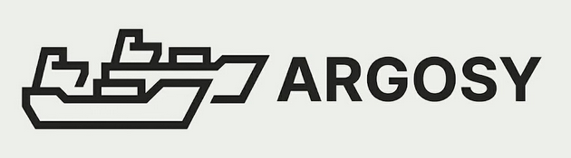

<p align="center">
  <picture>
    <source media="(prefers-color-scheme: dark)" srcset="assets/argosy_logo_dark.png" />
    <source media="(prefers-color-scheme: light)" srcset="assets/argosy_logo_light.png" />
    
  </picture>
</p>

Self-hosted, owned-media streaming server — a Plex alternative you actually build. The differentiator is **seamless cross-device resume** (start at the gym, finish on the TV).

Tracked in Switchyard under project **ARGY**.

## Stack

- **Backend:** Go — orchestration, metadata, HTTP, session management; shells out to `ffmpeg`/`ffprobe`.
- **DB:** PostgreSQL (JSONB metadata overrides; `LISTEN/NOTIFY` for live position handoff).
- **Web:** Vue 3 + TypeScript + Pinia; `hls.js` for playback.
- **Android:** native Kotlin + ExoPlayer.
- **API:** OpenAPI spec → codegen for the TS client and Go server stubs.
- **Streaming:** HLS with fMP4/CMAF; direct-play decision engine (direct play → remux → transcode); hardware accel + software fallback.

## Single-service model

Argosy ships as **one deployable artifact**. The Vue app is a static SPA with no server runtime — after `vite build` it is emitted into `internal/webui/dist` and **embedded into the Go binary** (`go:embed`), so one process serves the API, media streams, and the web UI on a single origin (no CORS, simpler device-token auth, one container to run).

The frontend/backend split lives at the **code** level and in **dev**, not in deployment:

- **Prod:** `make build` → `web/dist` embedded into `bin/argosy`.
- **Dev:** run the Go server and the Vite dev server side by side; Vite proxies `/api`, `/healthz`, `/stream`, `/hls` to the Go process.

## Layout

```
argosy/
├── cmd/argosy/          # server entrypoint (single binary)
├── internal/
│   ├── config/          # env-based configuration
│   ├── server/          # HTTP server: API + health + embedded SPA
│   ├── webui/           # go:embed of the built Vue app (dist/)
│   ├── mediatool/       # ffmpeg/ffprobe shell-out seam
│   ├── stevedore/       # P1 ingestion worker (stub)
│   ├── beacon/          # P4 live play-state push (stub)
│   └── ballast/         # P3 segment cache/cleanup (stub)
├── web/                 # Vue 3 + TS + Pinia SPA (Vite)
├── proto/openapi/       # API contract (P0, ARGY-13)
├── deploy/              # docker-compose / deploy assets (P0, ARGY-10)
└── .github/workflows/   # CI (P0, ARGY-14)
```

## Prerequisites

- Go 1.26+
- Node 24+ (`.nvmrc`) and npm
- `ffmpeg`/`ffprobe` on PATH for media work (optional for the scaffold; logged at startup)

## Quickstart

```bash
# Build the single artifact (web UI embedded into the server binary)
make build
./bin/argosy            # serves API + web UI on :8096

# Or run the server alone (serves a "not built yet" placeholder until the web is built)
make server-dev

# Front-end dev with HMR (proxies API to the Go server on :8096)
make web-dev            # http://localhost:5173
```

Health checks: `GET /healthz`, `GET /api/v1/ping`.

Run `make help` for all targets.

## Docker dev stack

A one-command local stack (PostgreSQL + the Go server with hot-reload via `air`, `ffmpeg` in the image) lives in `deploy/`:

```bash
cp deploy/.env.example deploy/.env   # optional: override ports / media path
make compose-up                      # Postgres + server (hot-reload) on :8096
make compose-web                     # ...also the Vite dev server on :5173 (HMR)
make compose-logs                    # tail logs
make compose-down                    # stop
make compose-reset                   # stop and delete volumes (drops the DB)
```

Defaults avoid the `construct-server` stack: server on `:8096`, Postgres published on host `:5433` (the server reaches it in-network on `5432`). Point `ARGOSY_MEDIA_DIR_HOST` at your library — it's mounted read-only at `/media`.

The production single-artifact image (SPA embedded into the Go binary + ffmpeg) is built from `deploy/Dockerfile`:

```bash
make docker-build    # -> argosy:dev
```

## Configuration

| Env var                | Default   | Purpose                                   |
| ---------------------- | --------- | ----------------------------------------- |
| `ARGOSY_ADDR`          | `:8096`   | HTTP listen address                       |
| `ARGOSY_DATABASE_URL`  | _(unset)_ | PostgreSQL DSN (used from the schema work) |
| `ARGOSY_MEDIA_DIR`     | `/media`  | Ingestion root (storage abstraction in P1) |

> **Port choice:** `:8096` is picked to avoid clashing with the `construct-server` Docker stack, which already publishes `80, 3000, 3001, 3002, 3923, 5432 (loopback), 5678, 8080, 8090, 8091, 8888, 11434`. When the P0 docker-compose lands (ARGY-10), Argosy's Postgres should likewise avoid host `5432` (publish `5433`, or don't publish it at all).
